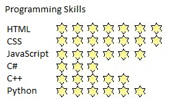
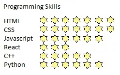
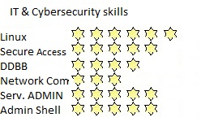
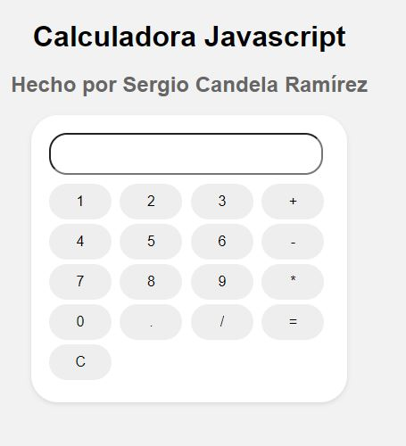
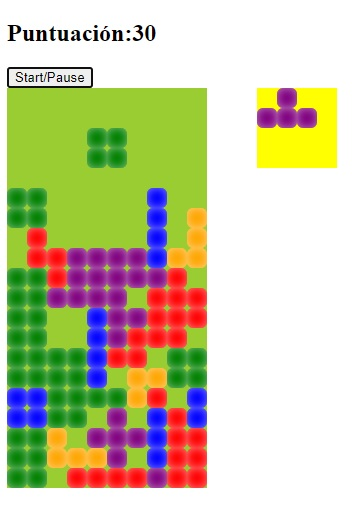
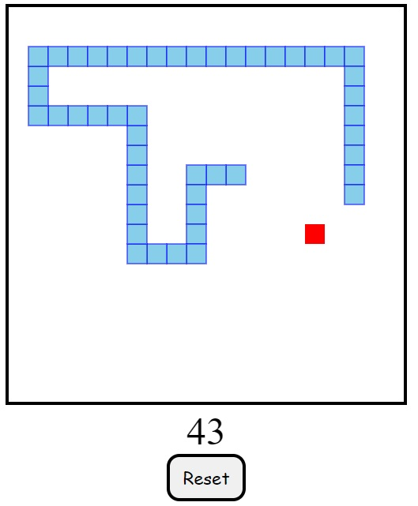
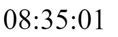
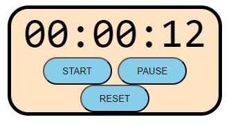
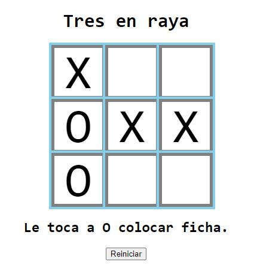

 ## Hello there! 😄 I'm Sergio2

 #### Mathematician and Web Developer 

 ### <u> Technical Skills </u>

<table>
  <tr>
    <td></td>
    <td></td>
    <td></td>
  </tr>
</table>

 
 ### <u> Soft Skills </u>
 <table>
  <tr>   
    <td>    
Web Design
   <td>
Great taste
   <td>
Extremely tidy
    <td>    
Hard worker
   <td>
There's always room to improve 
   <td>
Continuous learning! 
   </tr>
</table>

- [x] Great worker and team player, detail-oriented and highly organized.
- [x] Always a helping hand, proactive problem solver and critical thinker.

 
 

 ## <u> Projects in GitHub </u>

 ### Wanna join my newsletter?

 ## Click [AQUÍ!!](https://sergiowebdev.com/dejatuemail)

 
 
 ---

 
 ### Link to my PHP and Symfony blog 

[Blog PHP](https://blog.sergiowebdev.com)
 
 
---
 
 ### JavaScript

|  |      |  | 
|--------------|--------------|--------------|
| https://sergiocanram.github.io/simplecalc/| https://sergiocanram.github.io/Tetris/ | https://sergiocanram.github.io/snakey/ |

|   |      | |
|--------------|--------------|---------------|
| https://sergiocanram.github.io/timeplease/| https://sergiocanram.github.io/simpleTimer/| https://sergiocanram.github.io/tictactoe/ |

 

---  
 ### I'm here to contribute to your project!

> 🐦 Follow me on [Twitter](https://twitter.com/SergioCanRam)
> 
> 📫 To contact me, click the following email <sergiocanram@gmail.com>
>
> 😃 I enjoy solving hard problems

