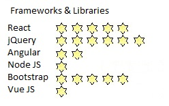

 ## Hello there! 😄 I'm Sergio2

 #### Mathematician and Web Developer 

 ### <u> SKILLS </u>

<table>
  <tr>
    <td></td>
    <td></td>
    <td></td>
  </tr>
</table>

 <u> Soft skills </u>
 <table>
  <tr>   
    <td>    
Web Design
   <td>
Great taste
    </td>   
   <td>
Extremely tidy
    </td>   
    <td>    

   <td>

    </td>   
   <td>

    </td>   
   </tr>
</table>

- [x] Great worker and team player
- [x] Always a helping hand
- [x] Detail-oriented and highly organized
- [x] Proactive problem solver and critical thinker

---
  
 ### I'm here to contribute to your project!

> 🐦 Follow me on [Twitter or X or whatever](https://twitter.com/SergioCanRam)
> 
> 📫 To contact me, click the following email <sergiocanram@gmail.com>
>
> 😃 I enjoy solving hard problems

